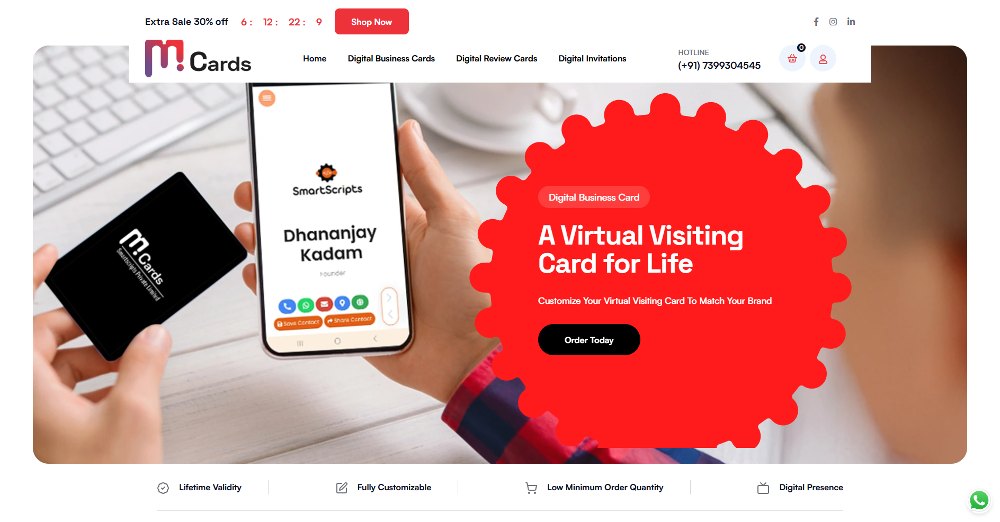

# mCards

**A unified platform for purchasing and managing innovative cards.**

[Visit our website](https://mcards.in)

---

## Tech Stack Used
- **Frontend:** React, Bootstrap  
- **Backend:** CodeIgniter 4, REST APIs  
- **Database:** MySQL

---

---
### 🏢  Overview

mcards is our flagship product engineered to simplify the process of purchasing and managing a broad array of card solutions. The platform supports multiple card types, including:

- **Digital Business Cards:** NFC and QR code-enabled cards made from PVC, metal, and wood.
- **Google Review Cards:** QR-enabled cards designed to enhance customer engagement.
- **Digital Invitations:** Stylish digital invitations for events such as weddings, birthdays, and shop openings.
- **Social Media Cards:** NFC-enabled cards that seamlessly integrate with various social media platforms.

### Tech Stack
- **Frontend:** Built with React for dynamic and responsive user interfaces, styled with Bootstrap for consistency.
- **Backend:** Developed using CodeIgniter 4, leveraging robust REST APIs for smooth operations.
- **Database:** MySQL powers the data layer, ensuring reliability and performance.

---

### 🎯 Objective

- **Unified Card Management:** Provide a single platform for managing both physical and digital card products.
- **Innovation Integration:** Utilize cutting-edge NFC and QR code technologies to bridge the physical and digital realms.
- **Customer-Centric:** Enhance user experience by offering diverse card options tailored to specific needs.

---

### 🚧 Challenges

- **Multi-Modal Product Support:** Integrating physical card production (PVC, metal, wood) with digital formats seamlessly.
- **Variety in Offerings:** Handling multiple card products (business, review, digital invitations, and social media) under one roof.
- **Scalability:** Building a system that scales efficiently with increasing user demands while ensuring high performance and security.

---

### 💡 Our Solution & Key Features

- **Robust Development Framework:** CodeIgniter 4 coupled with REST APIs ensures a resilient backend.
- **Dynamic Frontend:** A responsive UI built with React and styled by Bootstrap delivers a pleasant user experience.
- **Seamless Integration:** NFC and QR code technologies create tangible connections between physical cards and digital functionalities.
- **User-Centric Customization:** Empowering users with flexible options to select from various card types according to their needs.
- **Scalable Architecture:** Designed with scalability in mind to meet the evolving demands of our user base.

---

### 📈 Results  

- **Improved Customer Engagement:** Streamlined interactions between physical and digital card solutions have boosted user satisfaction.
- **Operational Efficiency:** Centralizing multiple card products has simplified process management and reduced overhead.
- **Market Differentiation:** mcards sets new standards in card services by integrating innovative tech with tangible products.

---

*For further details or inquiries, please contact our team at 
[contact@smartscripts.tech](mailto:contact@smartscripts.tech)
